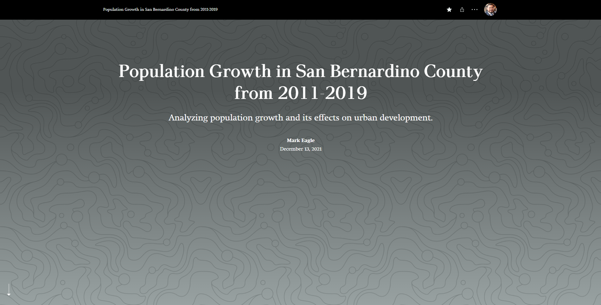

## Portfolio

---

### Previous Projects 

[Ranger Accessibility Path](https://github.com/chereagle1/chereagle1.github.io/blob/46d0c27a12d1707a58a32e9fea1aebb5cf1403af/images/Ranger%20Accessibility%20Paths.png)

---
[LA River Revitalization Plan, Park Prospects](https://github.com/chereagle1/chereagle1.github.io/blob/60113849667e2a074f07f0cb50c04f9444fd7993/images/Eagle%20Project%202.jpg)

---
[Grocery Store Network Analysis, Leon County](https://github.com/chereagle1/chereagle1.github.io/blob/ed976d2f79c6f9ae2ab569f7ba7a208e7c95bd77/images/Eagle%20Project%204.png) 

---
[Tracking Hurricane Katrina and Emily, 2005](https://github.com/chereagle1/chereagle1.github.io/blob/9a8ed8b32fc4b1494f9268fd4717b8ee09891408/pdf/Assignment%207%20Eagle.pdf)
<embed src="pdf/Assignment 7 Eagle.pdf" type="application/pdf" width="100%" height="600px" />

---
### Map PDFs

- [California "Camp Fire Wildfire" Analysis 2018](https://github.com/chereagle1/chereagle1.github.io/blob/d76f9af8bfcdc81c4e2de9ec6332b14b22ed2064/pdf/Final%20Project%20Mark%20Eagle.pdf)

---
### Story Maps
[Population Growth in San Bernardino County from 2011-2019](https://storymaps.arcgis.com/stories/30bf7dd78c4d4a70bc2f453d525050e0)

- [Project 3 Title](http://example.com/)
- [Project 4 Title](http://example.com/)
- [Project 5 Title](http://example.com/)

---

---

Page template forked from <a href="https://github.com/evanca/quick-portfolio">evanca</a>

<!-- Remove above link if you don't want to attibute -->
